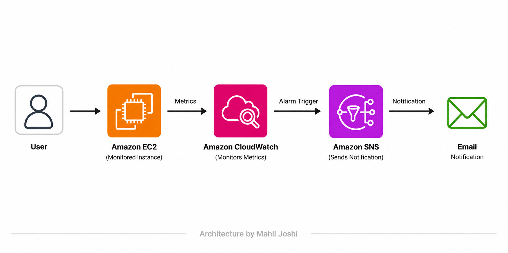

# AWS CloudWatch SNS Alerting System

A monitoring and alerting workflow built on AWS to understand how EC2 performance metrics can trigger automated notifications using CloudWatch and SNS.

---

## Architecture Diagram

---

## Overview

This project explores how AWS CloudWatch and SNS can be used together to implement a basic alerting pipeline for EC2 instances.

The focus is on understanding:
- How EC2 metrics are collected and visualized in CloudWatch  
- How threshold-based alarms are configured  
- How alert notifications are triggered and delivered using SNS  

---

## Architecture Flow

EC2 → CloudWatch → Alarm → SNS → Email Notification

---

## Implementation Details

### EC2 Metrics Monitoring
- Observed CPU utilization metrics generated by EC2 instances  
- Analyzed metric behavior using CloudWatch dashboards  

### CloudWatch Alarm Configuration
- Created alarms based on CPU utilization thresholds  
- Understood alarm states: OK → ALARM → INSUFFICIENT_DATA  
- Configured evaluation periods and threshold conditions  

### SNS Notification Setup
- Created SNS topic for alert delivery  
- Configured email subscription endpoint  
- Observed notification behavior based on alarm state changes  

### IAM Considerations
- Reviewed least-privilege access for monitoring and notification services  
- Understood permissions required for CloudWatch and SNS interaction  

---

## Validation Approach

- Observed CloudWatch metric behavior under different conditions  
- Verified alarm state transitions based on defined thresholds  
- Confirmed SNS notification flow triggered by alarm events  

---

## Key Learnings

- End-to-end understanding of AWS monitoring pipeline  
- How CloudWatch alarms detect anomalies using metric thresholds  
- How SNS enables real-time alert delivery  
- Importance of tuning thresholds to avoid false positives  

---

## Limitations & Scope

- This is a basic implementation focused on understanding workflow  
- Advanced configurations like scaling alerts, dashboards, or automation were not explored  
- Can be extended with Lambda, Auto Scaling, or incident response workflows  

---

## Note

This project focuses on understanding the CloudWatch–SNS monitoring workflow through a structured implementation approach.  
Further enhancements and deeper testing can extend it into a production-ready monitoring system.

---

## Author

Mahil Joshi  
LinkedIn: https://linkedin.com/in/mahiljoshi  
GitHub: https://github.com/mahiljoshi
